# django_project
Лабораторная работа #3. Введение в Django

## Часть 1. 
В данной части мы установили Django, убедились в корректной установке, создали проект и запустили его. Начали разработку приложения для опросов, создали и подключили базовый view. На текущий момент приложение успешно работает и отображает простую страницу. 

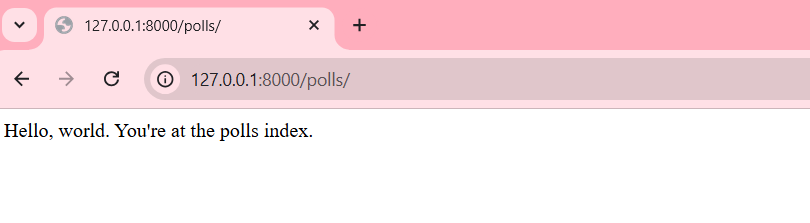

## Часть 2. 
Продолжая работу с приложением, мы создали модели для вопросов и вариантов ответов. Освоили использование миграций для работы с базой данных. Попробовали взаимодействовать с API базы данных Django, добавив и обработав данные. Также создали пользователя-администратора, настроили панель администратора и подключили туда функциональность для управления опросами.

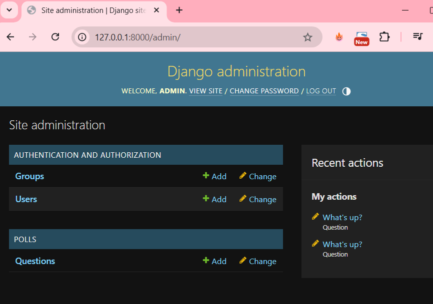

## Часть 3.
В данной части мы сосредоточились на представлениях (views) и применении шаблонов для улучшения внешнего вида страниц приложения. Реализовали обработку ошибок, чтобы при переходе по несуществующим ссылкам с вопросами отображалось сообщение об ошибке (404). Добавили функциональность для отображения вопросов и вариантов ответов.

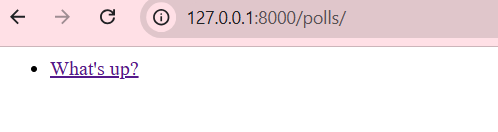
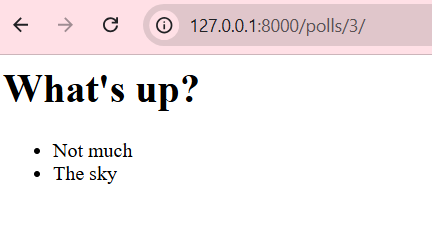
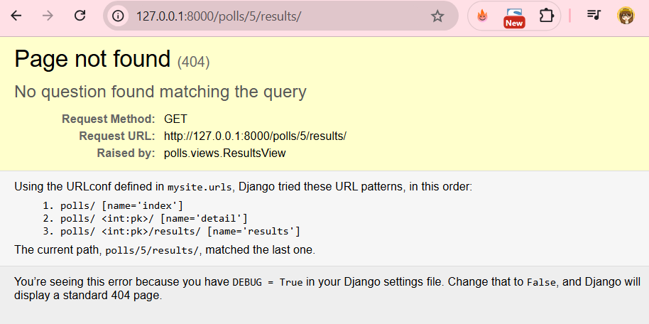

## Часть 4.
Мы доработали логику приложения для отправки и обработки ответов на опросы. Теперь при выборе ответа пользователя перенаправляют на страницу с результатами, где отображается количество голосов. Реализовали представления на основе классов (CBV), что улучшило структуру и читаемость кода. После всех доработок запустили сервер и протестировали функциональность нового приложения для опросов.

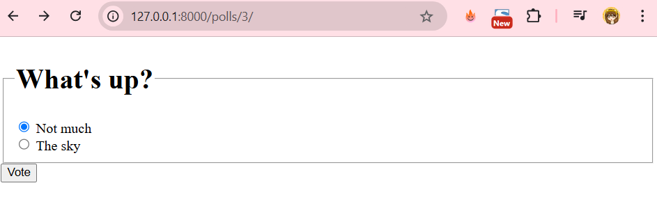
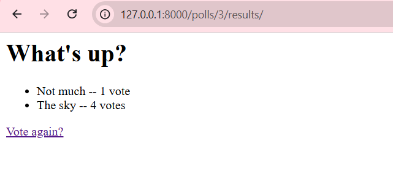

## Часть 5.
В этой части мы добавили автоматические тесты для проверки корректности работы приложения. 
- Написали модульные тесты для модели вопросов, чтобы проверить работу метода `was_published_recently()` с различными датами публикации.
- Добавили тесты для главной страницы приложения, чтобы убедиться, что отображаются только актуальные вопросы (с датой публикации в прошлом).
- Реализовали тесты для детальной страницы, которые проверяют отображение текста вопроса и возврат ошибки 404 для вопросов с датой публикации в будущем. 

## Часть 6.
В этой части мы улучшили внешний вид приложения, добавив таблицу стилей и фон. Создан каталог static для хранения CSS и изображений. Подключили таблицу стилей через  и настроили зелёные ссылки. Добавили фон через CSS с использованием изображения, размещённого в подкаталоге images.

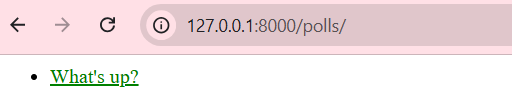
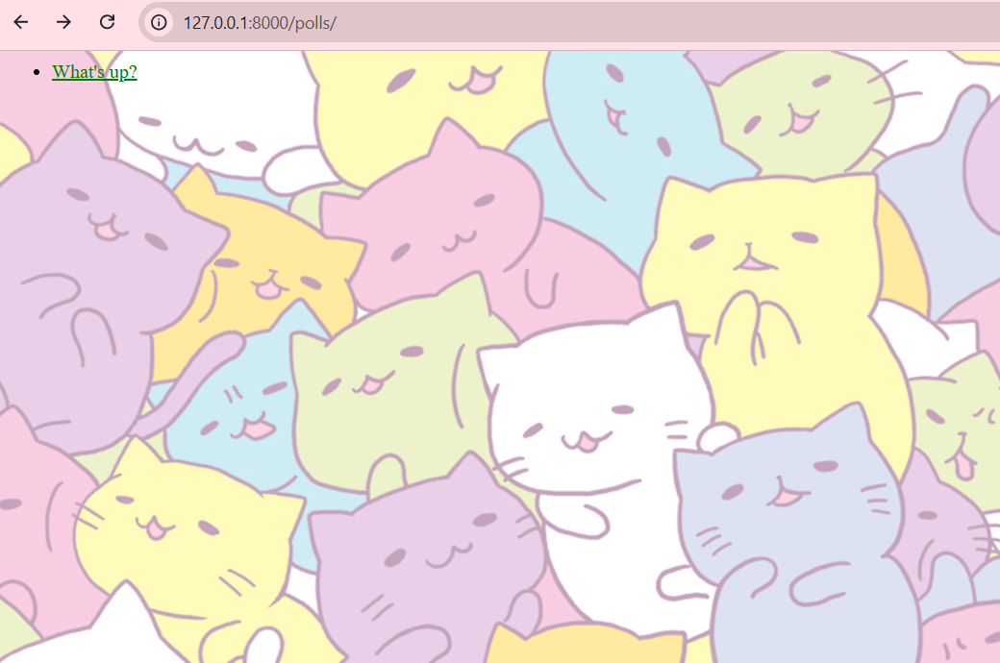

## Часть 7. 
В этой части мы улучшили панель администратора Django, настроив порядок и группировку полей, добавили возможность редактирования связанных объектов прямо на странице модели, исправили процесс добавления вопросов и ответов одновременно, оптимизировали отображение списка изменений с помощью новых столбцов, фильтров и поиска. Также улучшен внешний вид интерфейса, включая настройку пользовательских шаблонов для изменения заголовков, оформления страницы индекса администратора с использованием переменной app_list и переопределение базовых шаблонов, таких как admin/base_site.html.

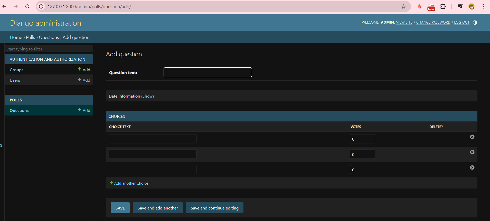
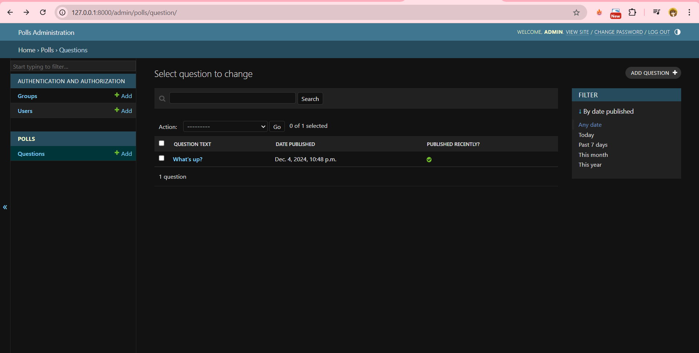
